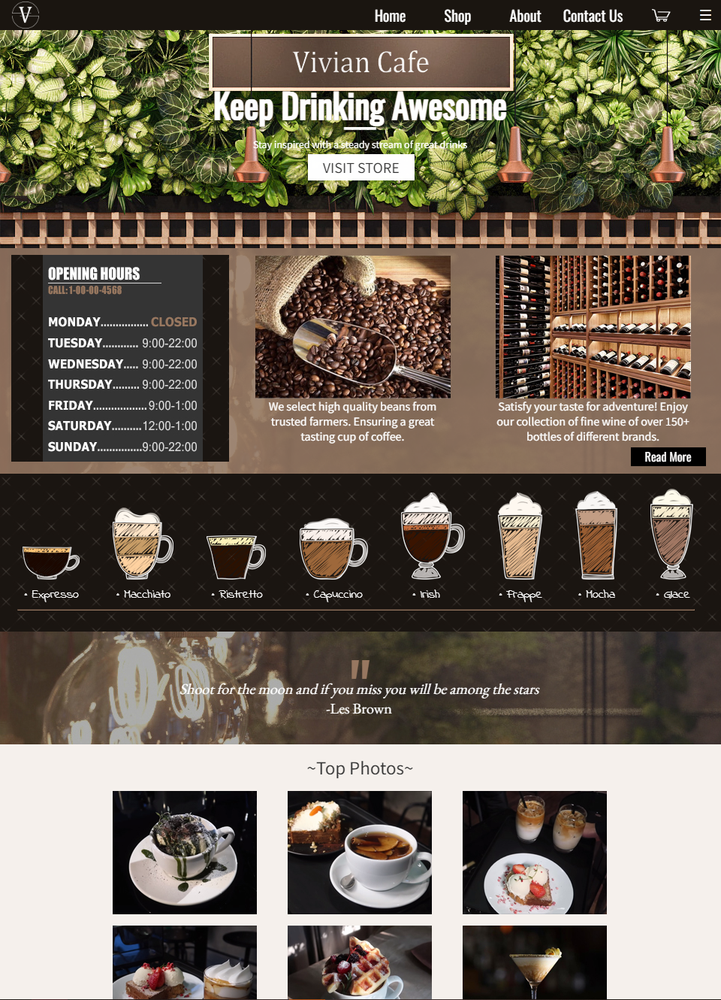

# Vivian Cafe Website
## Front-End Concept Business Website
This project was developed as a final project for my introductionary web development course at Macomb. This class focused only on front-end and the design aspect of websites. For our final, we were prompted to design and create a front-end website for a concept company.  
  
I decided to make a business site for a coffee and bar shop. From wireframe to implementation, the page was developed with HTML, CSS, and Photoshop. I kept the layout relatively simple, focusing on presentation and accessibility. Additionally, I looked into the posibilities of what CSS could do; Transition animations with parallax effects were used to further make the website more appealing.‍  
### Lessons Learned  
- HTML basics and CSS styling
- Standards and best practices for website development
- CSS animations
- Website UI/UX Design‍  
  
**Technologies Used:** HTML 5, CSS, Photoshop

### The Project Is Deployed!

